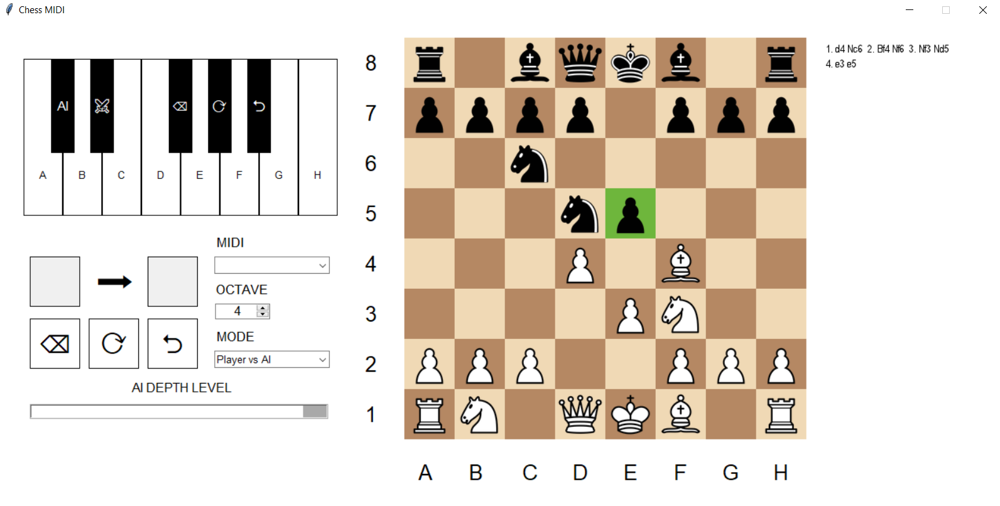

# midi-chess

Ever thought to yourself:
"Damn, I should really play some chess on a piano"? - me neither.
but it's actually quite fun to do.

midi-chess is a project that lets you control a game of chess using any MIDI controller.

Dragging pieces around with a mouse is overrated. Just play e4 in C major.
Forget the cursor - hit keys and hear how your chess openings actually sound in real time.

# Demonstration


# Executing

Requires ```python``` **(version 3.x)** to run
```
python main.py
```

#### Unfortunately, the program cannot run on Linux operating systems due to embedding compatibility issues.

#### The entire chess engine was built following [Eddie Sharick's YouTube tutorial](https://youtube.com/playlist?list=PLBwF487qi8MGU81nDGaeNE1EnNEPYWKY_&si=hNA4LYHYD02G7o1u)
